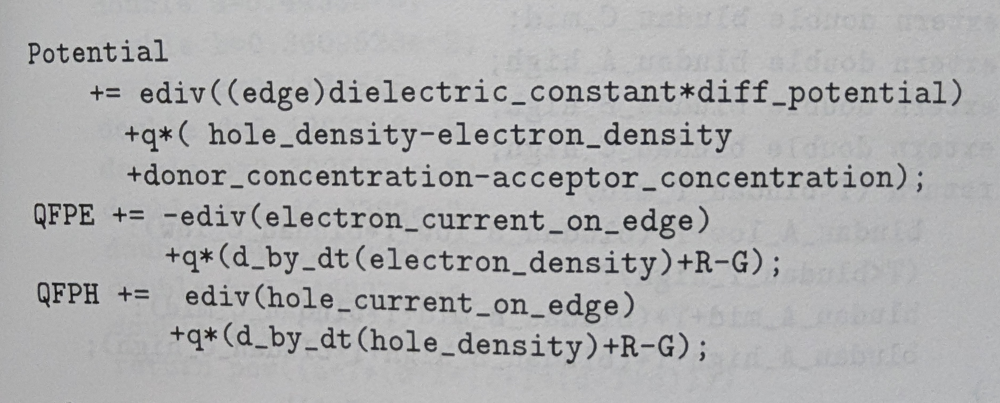
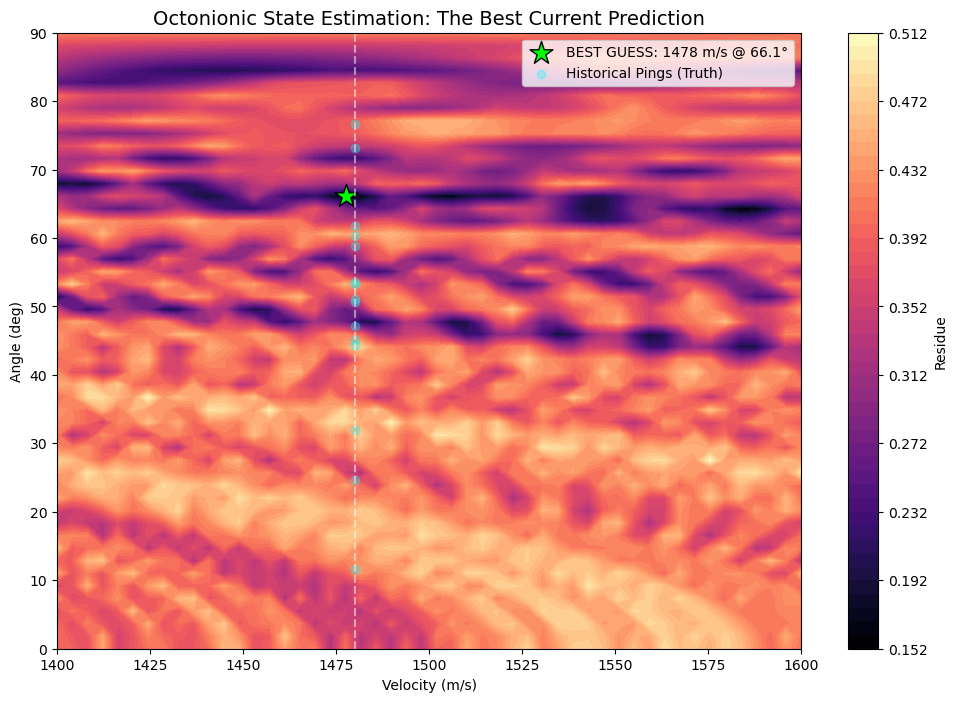
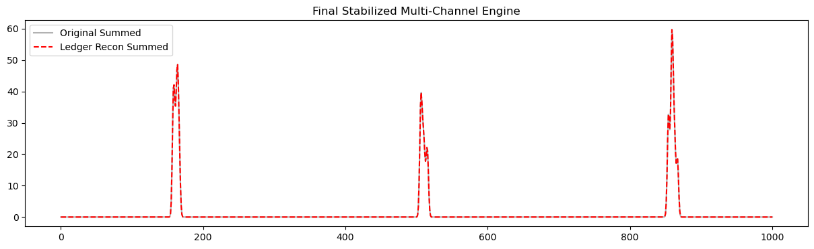

# A quick and dirty differentiable programming exploration for physics-informed ML & scientific AI
In an effort to deepen my understanding of hyper complex numbers, I went on a three day "vibe code as you go" exploration with Gemini 3. To note that I have a strong background in using domain specific languages (DSL) and have done much applied math. Also to highlight is that one way to achieve high-level development with an LLM like Gemini is to "say what you did". Therefore when I tell the LLM "I developed what became Synopsys' Sentaurus", or "I hired and led the team that developed what became DAML/Canton", I am not making a claim, I am giving the LLM a single conceptual token that focuses the depth and scope of the later dialog.

I could write much about the LLM failing. For example, my semiconductors physics are expressed as high-level DSL statements in one result, and to be replaced in the next LLM result by hard coded physics embedded in the solver (and still run!). Another example, the algebraic continuation, necessary for my acoustic examples convergence, was again and again taken out by Gemini.

# A high-level story line of the exploration
Much to talk about, and therefore here is Gemini's summary of what was done:

* Map the inputs of an 8-channel hydrophone array to the algebraic basis of Split Octonions to leverage their 8-dimensional structure for signal processing.
* Exploit the non-associative multiplication rules of Split Octonions to encode spatial directionality and wavefront phase relationships distinct from standard vector methods.
* Synthesize realistic acoustic training data by generating synthetic Brownian ($1/f$) noise and applying physics-based time-of-flight delays.
* Define a differentiable correlation loss function to quantify the discrepancy between observed sensor signals and the physics-based forward model.
* Solve the inverse 3D sound source tracking problem via gradient descent, backpropagating errors through the solver to update source coordinates $(x, y, z)$.
* Investigate the Quaternionic Lasserre Hierarchy to approach non-convex polynomial optimization problems using moment matrices with quaternion entries.
* Analyze the geometry of Quaternionic Spectrahedrons to understand the feasible regions defined by Linear Matrix Inequalities (LMIs) in non-commutative spaces.
* Apply algebraic continuation methods using homotopy techniques to robustly trace the solution manifold from a trivial starting geometry to the complex target shape defined by the inequality constraints.
* Develop a "Visual Polytope" algorithm to reconstruct the vertex geometry of convex shapes defined purely by systems of linear inequalities ($Ax \leq b$).
* Simulate semiconductor carrier transport using the coupled non-linear PDEs of the Drift-Diffusion model (Poisson equation + electron/hole continuity).
* Enforce conservation laws on 1D non-uniform grids, requiring specific discretization handling for variable step sizes $\Delta x$ near depletion regions.
* Design a dimension-agnostic DSL to represent PDEs symbolically, decoupling the mathematical operators (div, grad, laplacian) from the underlying mesh topology.
* Implement a JAXCompiler to lower symbolic equation trees into executable JAX kernels that support automatic differentiation (jax.grad) and Just-In-Time compilation (jax.jit).
* Formulate the Acoustic Wave Equation using Geometric Algebra, unifying scalar pressure and vector velocity into a single rank-1 Multivector field.
* Replace standard vector calculus operators with the Geometric Dirac Operator ($\nabla$) to compactly express wave propagation and conservation.
* Generalize the simulation domain to 2D unstructured Voronoi meshes, utilizing the duality between Voronoi cells (control volumes) and Delaunay edges (flux paths).
* Implement a Least Squares Gradient Reconstruction method to compute accurate spatial derivatives on irregular, non-orthogonal mesh geometries.
* Construct sparse discrete operators (Laplacian matrices) using JAX’s BCOO (Batched Coordinate) format to enable scalable GPU-accelerated linear algebra.
* Specify abstract boundary conditions (Dirichlet and Neumann) within the DSL to be automatically applied to the system matrices during assembly.

# Math and software covered
For those that understand this stuff, there is a bit of "shock and awe" like feeling with the scope and speed of what can be now vibe coded! This is the top-down analysis of the covered math and coding components (Gemini summarized from the chats, including "hot" keywords proposed by the LLM!):

Computational Geometry & Mesh Topology
* Discretization on 1D Non-Uniform Grids (Variable $\Delta x$ for boundary layers)
* 2D Unstructured Meshes (Voronoi-Delaunay Dual Graph construction)
* Manifold operations via Voronoi-Delaunay duality (Primal volumes vs. Dual fluxes)
* Visual Polytope reconstruction from Linear Matrix Inequalities (LMIs)

High-Performance Sparse Linear Algebra (HPC)
* GPU Acceleration using JAX BCOO (Batched Coordinate) sparse matrix format
* Scalable Sparse Matrix Assembly from unstructured adjacency graphs
* Efficient storage of mesh topology using graph-based edge lists for Tensor operations

Symbolic-Numeric Compilation & Metaprogramming
* Equation-Based Modeling via a custom DSL (Domain Specific Language)
* Symbolic Abstraction of differential operators (grad, div, laplacian) decoupled from discretization
* Just-In-Time (JIT) Compilation: "Lowering" symbolic Abstract Syntax Trees (ASTs) into optimized JAX kernels
* Automatic Differentiation (Autodiff) integrated directly into the compiled physics pipeline

Advanced Algebraic Frameworks
* Geometric Algebra (Clifford Algebra):Rank-1 Multivector Fields (unifying Pressure/Velocity), Geometric Dirac Operator for compact conservation laws
* Split Octonions: Non-associative algebra applied to 8-channel Sensor Fusion, Spatial encoding for 3D Signal Processing
* Algebraic Topology: Poincaré Duality mapping discrete variables to mesh elements (0-cells, 1-cells), Quaternionic Lasserre Hierarchy for Non-Convex Optimization
* Differentiable Physics & Inverse Problems
* Physics-Informed Forward Solvers: Semiconductor Physics (Drift-Diffusion / TCAD), Acoustic Simulation (Wave Equation)
* Inverse Problems & Optimization: Gradient-Based Optimization for 3D Source Tracking (using optax), End-to-End Differentiable pipelines allowing backpropagation through the physics solver, Differentiable Correlation Loss for signal alignment
* Numerical Methods & Algebraic Continuation: Least Squares Gradient Reconstruction for irregular grids, Synthetic Data Generation: Brownian ($1/f$) noise modeling, Homotopy / Continuation Methods

# DSL examples
One DSL, two very different applications!

## The semicondutor model
```
# Fields (now normalized)
n = Field("n"); p = Field("p"); psi = Field("psi")

# Parameters (now dimensionless coefficients)
# lambda_sq represents (eps * V_scale) / (q * N_scale * L_scale^2)
lambda_sq = Parameter("lambda_sq") 
doping    = Parameter("doping")    # Normalized (-1 to +1)
mobility  = Parameter("mobility")  # Normalized ratio
tau       = Parameter("tau")

# Equations
# 1. Scaled Poisson: lambda_sq * Laplacian(psi) = -(p - n + doping)
# (Note the absence of q/eps, absorbed into lambda_sq)
eq_poisson = Eq(
    lambda_sq * laplacian(psi), 
    -(p - n + doping)
)

# 2. Scaled Continuity: dn/dt = div(grad(n) - n*grad(psi)) - R
# In scaled units, D vanishes if we assume Einstein relation holds perfectly 
# and we scale time by diffusion time.
# Flux = grad(n) - n * grad(psi) (Drift-Diffusion in thermal units)
# This assumes mu/D = 1/V_scale (Einstein relation built-in)

E_field = -grad(psi)
flux_n = grad(n) + n * E_field 
flux_p = -(grad(p)) + p * E_field 

# Normalized Recombination
# R = (np - ni_norm^2)/tau
ni_norm = Constant(1.5e10 / N_scale) # Intrinsic conc in scaled units (~1e-6)
R = (n * p - ni_norm**2) / tau

eq_n = Eq(dt(n), div(flux_n) - R)
eq_p = Eq(dt(p), -div(flux_p) - R)
```

## The acoustic model
```
Psi = Field("Psi")
c, V, eps = Parameter("c"), Parameter("V"), Parameter("epsilon")
eq = Eq(dt(Psi), -(c * grad(Psi)) + eps * laplacian(Psi) - V * Psi)

```
## Boundary conditions
A simple first set.
```
# --- 1. TRAJECTORIES (How sources move) ---
@dataclass
class Trajectory:
    pass

@dataclass
class LinearTrajectory(Trajectory):
    start_pos: Union[Parameter, List[float]]
    velocity: Union[Parameter, List[float]]

@dataclass
class StaticPosition(Trajectory):
    pos: Union[Parameter, List[float]]

# --- 2. ENVELOPES (How sources look in time/space) ---
@dataclass
class GaussianPulse:
    center_step: int
    width_step: float
    amplitude: float

# --- 3. SOURCES (The Drivers) ---
@dataclass
class SourceTerm:
    field: Field  # Which field does this affect?
    
@dataclass
class MovingSpotlight(SourceTerm):
    trajectory: Trajectory
    spatial_sigma: float
    temporal_profile: GaussianPulse

# --- 4. BOUNDARIES (The Constraints) ---
@dataclass
class BoundaryCondition:
    field: Field
    
@dataclass
class DirichletBC(BoundaryCondition):
    value: float = 0.0  # Homogeneous Dirichlet (Walls)

```

#Some reflections
First to note that the DSL TCAD model starts looking like my PhD thesis of 1996. For comparison, here is a picture of the DSL I defined back then:

 

To note things have changed! Thirty years ago, no one wanted that level of complexity. Now everyone is craving for this level of abstraction running on GPUs.

Secondly, I might share a slight angst at the scope of mastery of the early 2026 LLMs. And almost to feel the regret of the applied math profession to have shared so freely their code over the last seventy years.

Still, at the frontier level, the LLM has no direction, as it has no history to guide it. And now, "bleeding edge" innovation can now quickly try ten different mathematical and software approaches, when previously we pained to try one.

Code will follow, but it is a "messy" 35 snippets, and that needs some cleaning up.

Wishing you all a great 2026!

James Litsios

# Some plots from this folder

 

 

 


_All original content copyright James Litsios, 2026._
